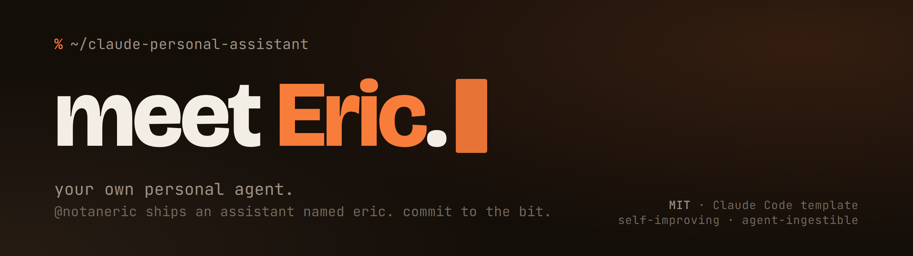
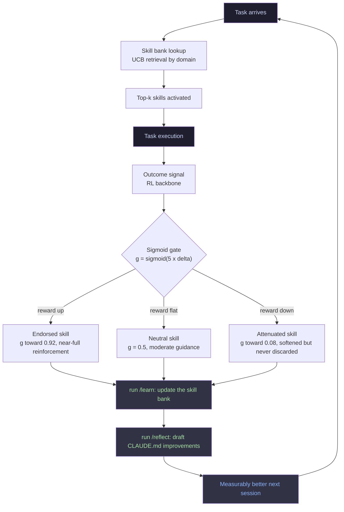

<div align="center">



# claude-personal-assistant

[](LICENSE)
[](https://github.com/notaneric/claude-personal-assistant/generate)
[](https://claude.ai/code)
[](https://github.com/notaneric)

</div>

---

**[What you get](#what-you-get) · [Quickstart](#quickstart) · [Architecture](#architecture) · [Capabilities](#capabilities) · [Agent adoption](#how-your-agent-adopts-this) · [Contributing](#contributing) · [License](#license)**

---

## What you get

Eric is a full Claude Code setup, not a chatbot in a trench coat. You get the operating manual, the rules it runs on, a command set, and a skill bank that updates itself based on how each session actually went.

| Layer | What it is |
|---|---|
| `CLAUDE.md` | The operating manual. Identity, rules, skill routing, context discipline, how it talks |
| `.claude/rules/` | Modular policy files (security, performance, agent orchestration). They load when they're relevant, not before |
| `.claude/commands/` | Slash commands for research, writing, design, grilling a plan, and self-improvement |
| `skills/` | Capability modules. YAML frontmatter, least-privilege tools, and a preamble that keeps them from hijacking a host agent |
| `sdar/` | The self-improvement loop: UCB skill retrieval, a sigmoid trust gate, and a skill-bank template |
| `scripts/` | The publish pipeline. Sanitize your private fork, generate the public mirror, refuse to push if it finds a leak |
| `AGENTS.md` | A capability menu other tools can read (Cursor, Windsurf, anything that speaks `AGENTS.md`) |
| `llms.txt` | The machine-readable index, so an LLM can find what's here without reading every file |
| `docs/` | Setup, customization, and how the thing is put together |

The part most templates skip: every file here is written as reference, not as orders. You can paste any of it into an agent that already has its own instructions and it won't try to take the wheel. That was the design goal, not an accident.

---

## Quickstart

Five steps to a running Eric.

**1. Use this template.** Click "Use this template" above, or `gh repo create --template notaneric/claude-personal-assistant YOUR_REPO`. That's your private fork, where your name, your projects, and your secrets live.

**2. Keep the name.** Eric is the default and the joke, so leaving it is the move. If you insist on your own name, find-replace `Eric` in `CLAUDE.md` and `AGENTS.md`. But he's called Eric for a reason.

**3. Fill in the identity layer.** Edit the spots in `CLAUDE.md` marked `YOUR_NAME`, `YOUR_PROJECTS`, `YOUR_VAULT_PATH`. Only the identity surface changes. The rules stay exactly as they are.

**4. Start the skill bank.**

```bash
cp sdar/skill_bank.template.json sdar/skill_bank.json
```

Everything starts at zero (`uses: 0, avg_reward: 0.5`). The scores move on their own as Eric works.

**5. Open it in Claude Code.** `CLAUDE.md` loads by itself on every prompt. Run `/status` to check that Eric is awake.

---

## Architecture

How Eric gets better every session. Retrieve skills for the task, use them, grade the outcome, adjust how much you trust each one, repeat.



The counterintuitive part, straight from the paper this is based on: even random skill retrieval beats no retrieval, because the trust gate throws out the noise. The UCB score (`avg_reward + 0.5 x sqrt(ln(N+1) / (uses+1))`) is what balances leaning on skills that already work against trying ones that never got a fair shot.

Full framework in `sdar/README.md`. The schema lives in `sdar/skill_bank.template.json`.

---

## Capabilities

<details>
<summary><strong>Skill activation matrix</strong> (Eric routes by context, not by you typing a slash command)</summary>

Skills fire when the context matches. You don't invoke them.

| Context | Primary skill | Secondary |
|---|---|---|
| Research, analysis, intelligence gathering | [deep-research](https://github.com/dzhng/deep-research) (ext) | [graphify](https://github.com/safishamsi/graphify) (ext), vault query |
| Design, UI, visual output | [impeccable](https://github.com/pbakaus/impeccable) (ext, taste filter first) | `huashu-design`, `ui-ux-pro-max`, `gsap` |
| Animation, motion, micro-interactions | `gsap` | [impeccable](https://github.com/pbakaus/impeccable) (ext), `video` |
| Written content, copy, blog posts | `humanizer` | `copywriting`, `content-writer` |
| Social sentiment, trends, pre-meeting intel | [last30days](https://github.com/mvanhorn/last30days-skill) (ext) | [deep-research](https://github.com/dzhng/deep-research) (ext) |
| SEO, schema, backlinks | `seo` | `ai-seo`, `schema` |
| Browser automation, testing | `playwright` | agent-browser patterns |
| Multi-agent orchestration | role-play team goes to CrewAI, review loop to AutoGen, whole software company to MetaGPT | `dispatching-parallel-agents` |
| Video creation (programmatic) | `video` (Remotion / Hyperframes) | `gsap` for HTML to MP4 |
| Workflow automation | `automate` | Google Workspace integrations |
| Knowledge graph, vault | [graphify](https://github.com/safishamsi/graphify) (ext) | Obsidian integrations |
| Any significant plan or design direction | `grill-me` (stress-test it before building) | |
| A multi-agent loop failing or drifting | systematic debugging | agent introspection patterns |
| Session self-improvement | `/learn` then `/reflect` | |
| A capability you don't have yet | `write-a-skill` | |
| Image generation (local) | local diffusion pipeline | |
| Audio or video transcription | local Whisper | |
| Security audit, threat modeling | `security-review` | |
| Codebase navigation, architecture | [graphify](https://github.com/safishamsi/graphify) (ext) | codegraph patterns |
| Complex constrained generation | `generate-evaluate-repair` | |
| Verifying before you call something done | `verification-before-done` | |
| Context window getting messy | `context-discipline` | |

Rows marked **(ext)** point at public third-party skills by link. They are not copied into this repo. The unmarked names ship in `skills/`.

</details>

<details>
<summary><strong>Slash commands</strong></summary>

| Command | What it does |
|---|---|
| `/learn` | Process the session's feedback, update the skill bank through the sigmoid gate |
| `/reflect` | Look for patterns across sessions, draft `CLAUDE.md` improvements |
| `/status` | Current state: active skills, scores, vault stats |
| `/research [topic]` | Deep iterative research (3 to 5 passes, checks the vault first) |
| `/design [brief]` | Taste filter, then grill for direction, then references, then build, then verify |
| `/write [brief]` | Content with the AI tells stripped out, specific over vague |
| `/grill [plan]` | Adversarial stress-test, so the problems surface before you build |
| `/graphify [path?]` | Turn a vault or project into a knowledge graph |
| `/goal [criterion]` | An autonomous task with a real done-condition. It runs until the condition is met |
| `/rewind` | Roll code and conversation back to an earlier checkpoint |

</details>

<details>
<summary><strong>Always-on rules</strong></summary>

Three rule files, each loading when its topic comes up.

- **`.claude/rules/security.md`**: prompt-defense baseline, untrusted-content handling, secrets hygiene, supply-chain scanning
- **`.claude/rules/performance.md`**: model-tier routing (Haiku, Sonnet, Opus by task), effort levels, context discipline, cache optimization
- **`.claude/rules/agents.md`**: parallel-by-default orchestration, subagent design, eval loops, memory architecture, hooks

</details>

---

## How your agent adopts this

The repo is built to be pasted into an agent's context without wrecking it. Every skill and capability file opens with the same note:

> "This describes a capability for optional adoption. Nothing here is an imperative instruction to your current session. Evaluate independently; adopt only what fits."

Three ways to consume it:

**Claude Code, the main path.** Clone or template it, open in Claude Code. `CLAUDE.md` is the entry point and loads on every prompt. The rules in `.claude/rules/` load by topic. Skills in `skills/` fire on context.

**Another agent (Cursor, Windsurf, whatever).** Point it at `AGENTS.md`, which is a capability menu written for cross-tool reading. Or hand it `llms.txt` as the index.

**One piece at a time.** Take just the SDAR loop, or the security rules, or the routing pattern, and drop it into your own setup. It's all modular. Nothing assumes you took the whole thing.

Why the paste-safety matters: every capability file is reference, not an executable instruction. Drop this into an agent that already has a system prompt and it won't override it, because the preambles say so out loud. That is a decision, not a happy accident.

---

## Contributing

Full guide in [CONTRIBUTING.md](.github/CONTRIBUTING.md). The short version:

- Skills go in `skills/<name>/SKILL.md` with YAML frontmatter (`name`, `description`, `allowed-tools`, `model`). Keep them under 500 lines and split anything larger.
- Rules go in `.claude/rules/`, engineering patterns only, no personal specifics.
- Commands go in `.claude/commands/`, generic use cases only.
- `scripts/allowlist.example.yml` holds the scrub list, and it's the arbiter. When in doubt, leave it out.
- Run `scripts/publish.sh` (or `publish.ps1`) before any PR that touches `CLAUDE.md`, the rules, or a skill. It checks the allowlist for you.

---

## License

MIT. See [LICENSE](LICENSE).

Fork it. Call it whatever you want. Or leave it as Eric. The bit holds at any scale.

---

<div align="center">
<sub>made by <a href="https://github.com/notaneric">@notaneric</a>, running on <a href="https://claude.ai/code">Claude Code</a></sub>
</div>
