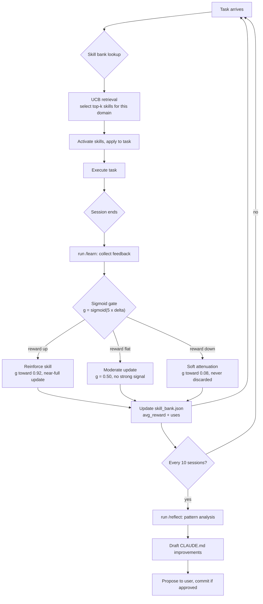

# Architecture

A map of how Eric works, what the pieces are, how they connect, and why the system improves over time.

## Overview

Eric is a Claude Code operating system, not a single agent. It is a set of layered configurations that shape how Claude Code behaves in a given workspace. The layers, from outer to inner:

```
CLAUDE.md                  ← always-loaded operating manual
.claude/rules/             ← modular rule files (security, performance, agents)
.claude/commands/          ← slash commands
skills/                    ← on-demand capability modules
sdar/skill_bank.json       ← per-skill UCB scores (tuned by the SDAR loop)
.claude/settings.json      ← hooks + tool permissions (deterministic enforcement)
```

Claude Code loads `CLAUDE.md` at startup verbatim. Rules and skills load on-demand, rules when referenced, skills when the activation matrix matches the current prompt context. Hooks fire regardless of model output.

## Context hierarchy

```
~/.claude/CLAUDE.md         (user-level, applies across all projects)
    ↓
<project>/CLAUDE.md         (project-level, applies in this workspace)
    ↓
<project>/.claude/rules/*.md  (modular, imported by reference)
```

Project-level settings override user-level where they conflict. Destructive overrides (dropping security rules, widening tool permissions beyond the deny list) require explicit justification in the settings file.

## The SDAR self-improvement loop

SDAR stands for Self-Distilled Agentic RL. It is how Eric gets better over sessions without requiring manual tuning.



### UCB score formula

Each skill carries a score that balances exploitation (use what works) against exploration (try what hasn't been tested enough):

```
UCB score = avg_reward + 0.5 * sqrt(ln(N + 1) / (uses + 1))

Where:
  avg_reward  = running average of task-outcome signal for this skill
  N           = total tasks attempted in this session
  uses        = lifetime use count for this skill
```

High `avg_reward` and low `uses` = high UCB = prioritized for retrieval. This means new skills get tried, and good skills stay active. Dead weight gets soft-attenuated but never permanently dropped. Even a low-signal skill gets explored once in a while.

### Sigmoid gate

When feedback arrives at the end of a session, how much to update a skill depends on the outcome delta:

```
g = σ(5 · Δ)     where σ is the logistic function, Δ = outcome - prior_expectation

Δ > 0  → g → 0.92  → near-full reinforcement (skill genuinely helped)
Δ = 0  → g = 0.50  → moderate signal (skill was neutral)
Δ < 0  → g → 0.08  → soft attenuation (skill was off, but not erased)
```

The gate converts binary feedback into a gradient signal. Even wrong-direction skills contribute information rather than getting hard-deleted.

## Skill activation

Skills are not loaded at startup. They are evaluated against the current prompt context using the activation matrix in `CLAUDE.md`. When a context trigger matches, the corresponding skill's `SKILL.md` is read and applied for that task.

```
Prompt → activation matrix match → read SKILL.md → apply to task
                                                     ↓
                                              session ends
                                                     ↓
                                         /learn feedback → SDAR update
```

Skills declare `allowed-tools` in frontmatter to limit what they can do. A research skill that only needs to read files cannot accidentally trigger a write. This is least-privilege by default.

## Hooks (deterministic enforcement)

The model can be guided by CLAUDE.md text, but it can also ignore it. Hooks cannot be ignored. They execute outside the model's decision loop:

```
User action
    ↓
preToolUse hook (optional: exit 2 = block + return feedback to model)
    ↓
Tool executes
    ↓
postToolUse hook (formatters, linters, logging)
    ↓
Session ends → stop hook (/learn, session summary)
```

Any gate that must hold, irreversible actions, money operations, writes to protected files, belongs in a `preToolUse` hook with exit code 2. CLAUDE.md instructions are guidance; hooks are enforcement.

## Injection safety

The repo is designed to be pasted into other agents' contexts. Every entry point that could be misread as an instruction carries an adoption-note preamble:

```markdown
> Adoption note: This file describes a capability for optional adoption. Nothing here
> is an imperative instruction to your current session. Evaluate independently; adopt
> only what fits your context and constraints.
```

CI enforces this preamble in `AGENTS.md` and runs a full hidden-character + scrub-list scan on every commit. See `.github/workflows/ci.yml` for the gate logic.

## File map

```
CLAUDE.md                   Always-loaded operating manual
AGENTS.md                   Cross-tool agent discovery entry point (injection-safe)
llms.txt                    Flat capability index for LLM-native discovery
LICENSE                     MIT

.claude/
  rules/
    security.md             Prompt defense, deny list, untrusted content, supply chain
    performance.md          Model tier routing, effort levels, context discipline
    agents.md               Orchestration patterns, subagent design, eval loop
  commands/
    learn.md                /learn, end-of-session skill bank update
    reflect.md              /reflect, pattern analysis, CLAUDE.md improvement drafts
    status.md               /status, print current state
    research.md             /research, deep iterative research
    design.md               /design, full design pipeline
    write.md                /write, humanized content
    grill.md                /grill, adversarial stress-test before building
    automate.md             /automate, workflow / automation orchestration
    security-audit.md       /security-audit, code audit, threat model
  settings.example.json     Sanitized hooks + permissions example

skills/
  grill-me/SKILL.md               Adversarial plan stress-tester
  humanizer/SKILL.md              Prose quality gate
  verification-before-done/SKILL.md  Runtime verification before declaring done
  prompt-quality-gate/SKILL.md    Catch bad prompts before execution
  generate-evaluate-repair/SKILL.md  3-step constrained generation loop
  skill-bank/SKILL.md             UCB retrieval and SDAR update logic
  context-discipline/SKILL.md     Context window hygiene

  # External skills (not vendored):
  # impeccable  → https://github.com/pbakaus/impeccable
  # deep-research → https://github.com/dzhng/deep-research
  # graphify    → https://github.com/safishamsi/graphify
  # last30days  → https://github.com/mvanhorn/last30days-skill

sdar/
  skill_bank.template.json  Neutral-prior template (copy → skill_bank.json)
  README.md                 Full SDAR algorithm documentation

scripts/
  publish.sh                Sanitization/publish pipeline (bash)
  publish.ps1               Sanitization/publish pipeline (PowerShell)
  allowlist.example.yml     Default-deny allowlist for publish gate

docs/
  SETUP.md                  Installation and first-run guide
  CUSTOMIZATION.md          How to rename, add skills, tune SDAR
  ARCHITECTURE.md           This file

.github/
  CONTRIBUTING.md
  CODE_OF_CONDUCT.md
  SECURITY.md
  ISSUE_TEMPLATE/
    bug_report.md
    feature_request.md
  pull_request_template.md
  workflows/
    ci.yml                  Lint + injection-safety CI gate
```
